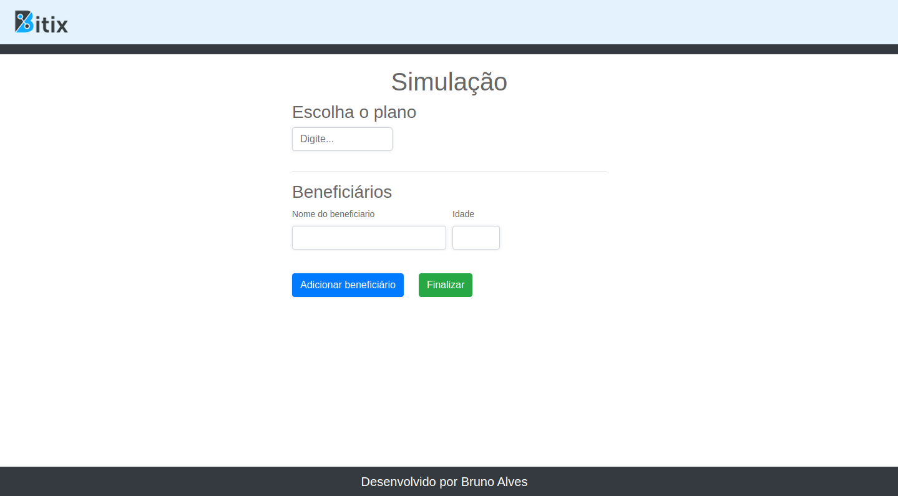

  

<h1 align="center">Teste PHP</h1>

O projeto consome um <strong>JSON</strong> buscando os dados dos planos de saúde, valores e regras
 de preços

  
## :rocket: Tecnologiase ferramentas

### Este projeto foi desenvolvido com as seguintes tecnologias:

| [PHP](https://www.php.net/)
| [JS](https://www.javascript.com/)

## :computer: Telas

</img>

## :round_pushpin: Demo

<strong>http://bitix.bas.inf.br/</strong> | para testar 

## :memo: License

#### Este projeto está sob licença [MIT](./LICENSE) &copy; [Bruno Alves](http://bas.inf.br/)
